# How to send an email using Gmail API?

**Step-1)** Create an account on [Google Cloud Platform](https://cloud.google.com/)
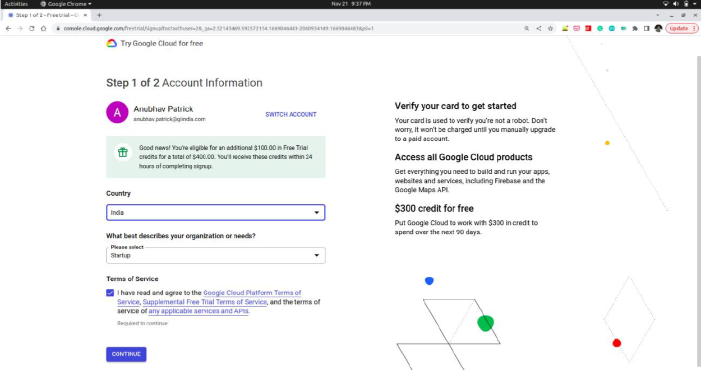
Enter the relevant details regarding to your account and complete the Google Cloud Account using your organization’s email id.
> **Note:** You do not have to provide your credit/debit card details. If it shows to provide the card details again and again, cut the window and retry.

**Step-2)** Create a new project called Gmail API Project
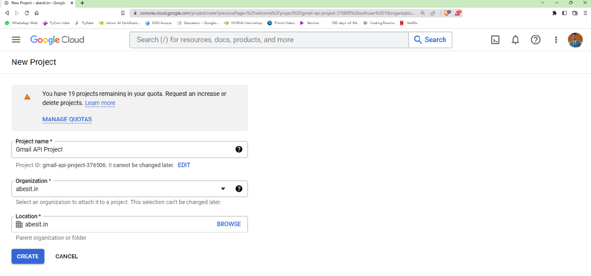

**Step-3)** Select the created project from the top pane.
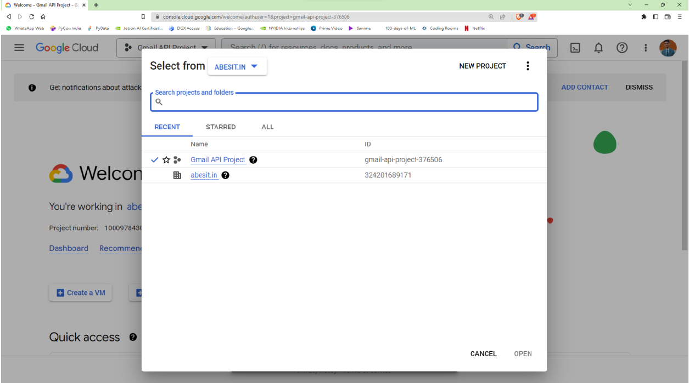

**Step-4)** Type Gmail API in the search prompt and select Gmail APi from Marketplace.
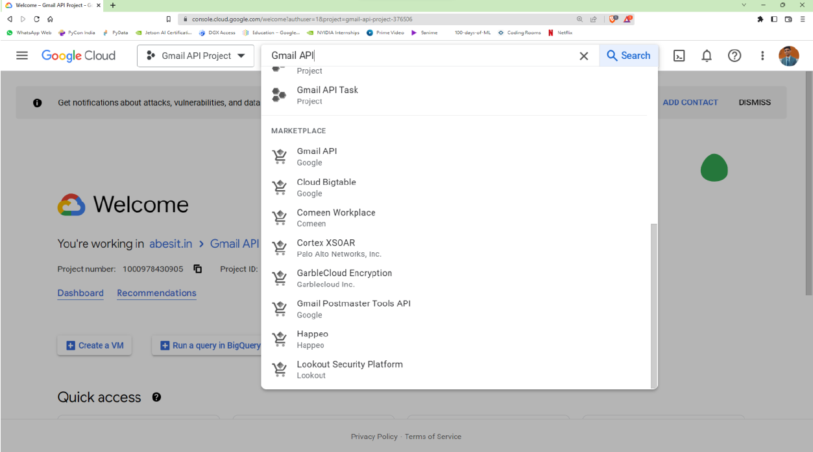

**Step-5)** Enable Gmail API
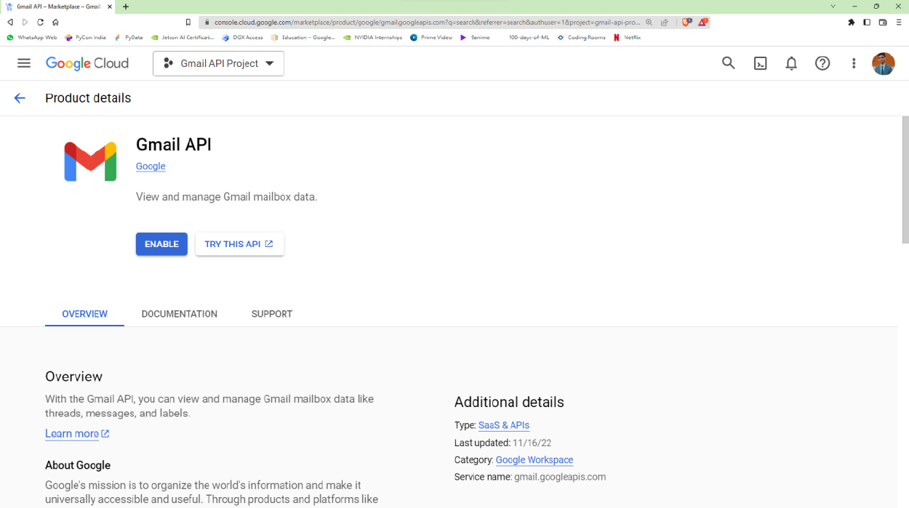

**Step-6)** Click OAuth Consent Scree from the side menu bar and select Internal.
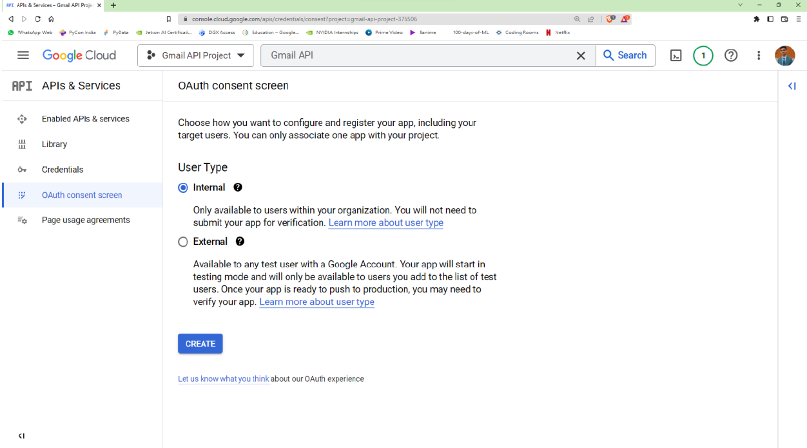

**Step-7)** Click on the Create button. Then, fill the required fields as per your project concerns.
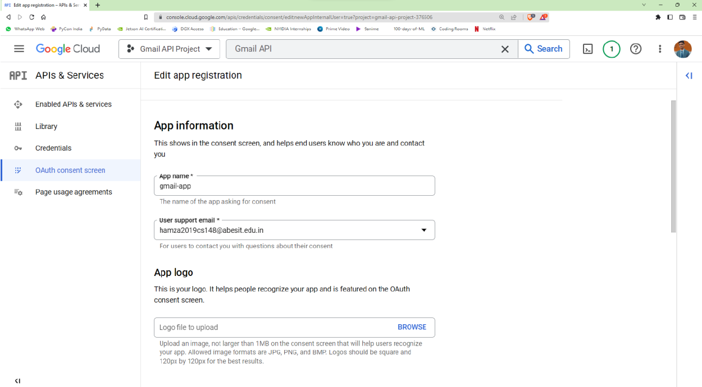

**Step-8)** Click Save and Continue, and finally Back to Dashboard. You will see a screen something like this.
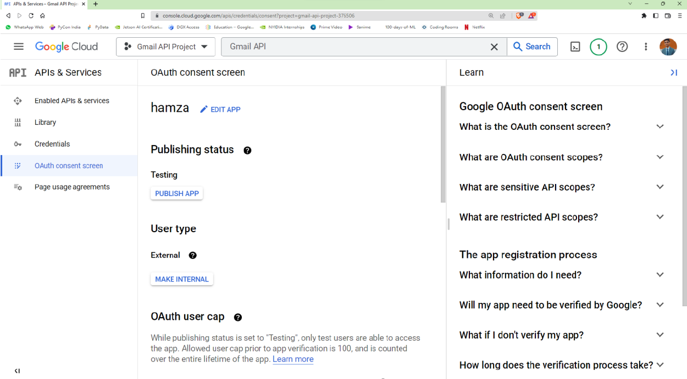

**Step-9)** Navigate to credentials window by clicking on Credentials menu from the sidebar.
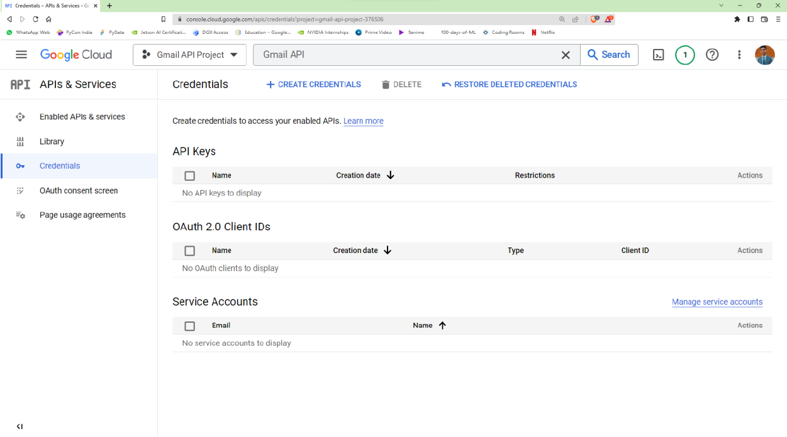

**Step-10)** Click on + CREATE CREDENTIALS and select OAuth Client ID. Select your application type and input name for your application.
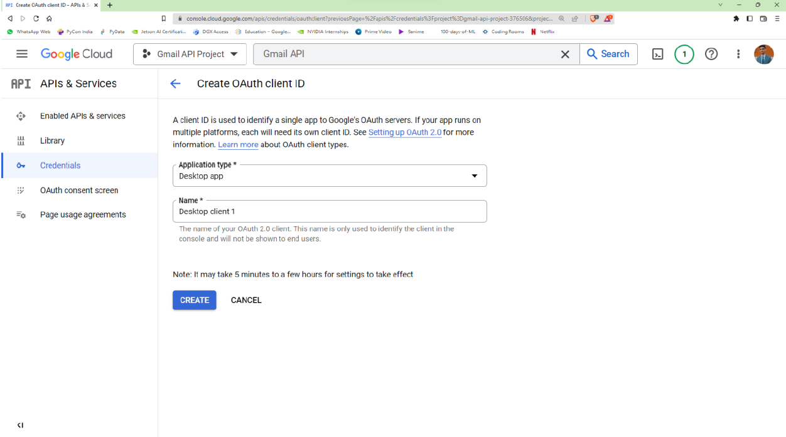

**Step-11)** Click on Create button and Download JSON.
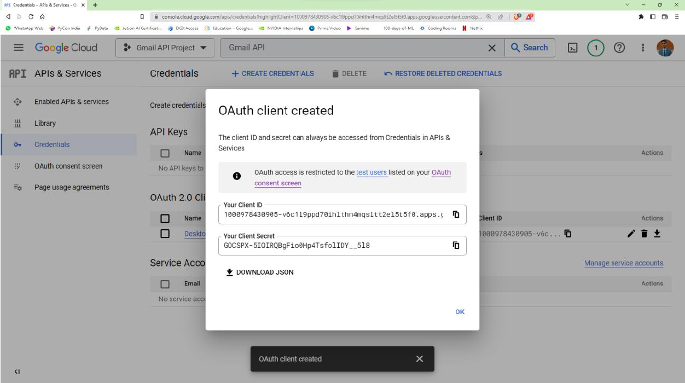

**Step-12)** Now create a project directory.
```bash
mkdir gmail_api
cd gmail_api
```

**Step-13)** Create a virtual environment and activate it.
```bash
python3 -m venv venv/
source venv/bin/activate
```

**Step-14)** Install the Google client library for Python.
```bash
pip3 install --upgrade google-api-python-client google-auth-httplib2 google-auth-oauthlib
```

**Step-15)** Move the client secret (`client_secrets.json`) downloaded in step 8 to `gmail_api/` directory and do not share this file anywhere else since your Gmail account can be accessed by anyone using these credentials.

**Step-16)** Create a new python file inside `gmail_api/` titled `send_mail.py`
```code
"""
This module sends emails with attachments to the participants
Reference - https://developers.google.com/gmail/api/quickstart/python
"""

import base64
import mimetypes
import os
from email.message import EmailMessage

from google.auth.transport.requests import Request
from google.oauth2.credentials import Credentials
from google_auth_oauthlib.flow import InstalledAppFlow
from googleapiclient.discovery import build
from googleapiclient.errors import HttpError

# If modifying these scopes, delete the file token.json.
SCOPES = ['https://www.googleapis.com/auth/gmail.send']


def authentication():
    credentials = None

    # The file token.json stores the user's access and refresh tokens, and is created automatically when the authorization flow completes for the time.
    if os.path.exists('token.json'):
        credentials = Credentials.from_authorized_user_file(
            'token.json',
            SCOPES
        )

    # If there are no valid credentials available, le the user log in.
    if not credentials or not credentials.valid:
        if credentials and credentials.expired and credentials.refresh_token:
            credentials.refresh(Request())
        else:
            flow = InstalledAppFlow.from_client_secrets_file('client_secrets.json', SCOPES)
            credentials = flow.run_local_server(port=0)

        # Save the credentials for the next run
        with open('token.json', 'w') as token:
            token.write(credentials.to_json())

    return credentials


def prepare_and_send_email(recipient, subject, message_text, attachment):
    """
    Prepares and send email with attachment to the participants.
    :param attachment: file path of the attachment that you want to send.
    :param recipient: email-id of the recipient
    :param subject: subject of the email
    :param message_text: body of the email
    """

    credentials = authentication()

    try:
        # Call the Gmail API
        service = build(serviceName='gmail', version='v1', credentials=credentials)

        # create message
        message = create_message('hamza2019cs148@abesit.edu.in', recipient, subject, message_text, attachment)
        send_message(service, 'me', message)
    except HttpError as error:
        # TODO(developer) - Handle errors from gmail API
        print(f"An error occurred: {error}")


def create_message(sender, to, subject, message_text, attachment):
    """
    Create a message for an email.
    :param attachment: file path of the attachment that you want to send.
    :param sender: Email address of the sender.
    :param to: Email address of the receiver.
    :param subject: The subject of the email message.
    :param message_text: The text of the email message.
    :return: An object containing a base64url encoded email object.
    """

    # create gmail api client
    mime_message = EmailMessage()

    # headers
    mime_message['From'] = sender
    mime_message['To'] = to
    mime_message['Subject'] = subject

    # text
    mime_message.set_content(message_text)

    # attachment
    attachment_filename = attachment
    # guessing the MIME type
    type_subtype, _ = mimetypes.guess_type(attachment_filename)
    maintype, subtype = type_subtype.split('/')

    with open(attachment_filename, 'rb') as fp:
        attachment_data = fp.read()
    mime_message.add_attachment(attachment_data, maintype, subtype, filename=attachment_filename)

    return {'raw': base64.urlsafe_b64encode(mime_message.as_bytes()).decode()}


def send_message(service, user_id, message):
    """
    Send an email message.
    :param service: Authorized Gmail API service instance.
    :param user_id: User's email address. The special value 'me' can be used to indicate the authenticated user.
    :param message: Message to be sent.
    :return: Sent Message.
    """

    try:
        message = (service.users().messages().send(userId=user_id, body=message).execute())
        print(f"Message Id: {message['id']}")
        return message
    except HttpError as error:
        # TODO(developer) - Handle errors from gmail API
        print(f"An error occurred: {error}")


if __name__ == "__main__":
    prepare_and_send_email('hamzaaziz822@gmail.com', 'Greeting from Hamza Aziz', 'This is a test email', 'photo.jpg')
```

**Step-17)** Run the python file.
```bash
python3 send_mail.py
```
At the first time you will be prompted to enter you Google account credentials. Use the same credentials that you used to sign up in Google Cloud.
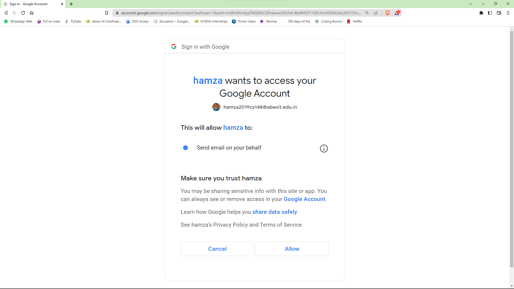
